# StudentHub — Student Management System

StudentHub is a real-world **Student Management System** built with **Pure PHP, Object-Oriented PHP, MySQL/MariaDB, HTML, CSS, JavaScript, and Bootstrap 5.3**.

The project was developed as a backend-focused application to practice and demonstrate PHP application architecture, database design, authentication, authorization, CRUD operations, role-based access control, security, and common school-management workflows.

## Key Features

### Admin

- Admin dashboard
- Student management
- Teacher management
- Class and section management
- Subject management
- Exam management
- Marks and results management
- Attendance management
- Fee management
- Assignment management
- Timetable management
- Notifications
- Reports and exports
- Teacher class and subject assignments

### Teacher

- Teacher dashboard
- View assigned students and classes
- Attendance management
- Assignment creation and management
- Assignment submission review
- Exam and marks management
- Timetable
- Password change

### Student

- Student dashboard
- Student profile
- Attendance
- Assignments
- Assignment submissions
- Exams and results
- Fees
- Timetable
- Notifications

### Parent

- Parent dashboard
- View linked children
- Access child-related academic information

## Security and Backend Practices

The project focuses strongly on backend security and application structure.

- Object-Oriented PHP architecture
- PDO with prepared statements
- Password hashing using PHP's password hashing API
- Role-based authorization
- Session-based authentication
- CSRF protection
- Login attempt throttling
- Session regeneration
- Session idle timeout
- Protected application directories
- Secure file-upload handling
- Server-side validation
- Centralized authentication logic
- Separation of database, business logic, and presentation concerns

## Technology Stack

### Backend

- PHP 8+
- Object-Oriented PHP
- PDO
- MySQL / MariaDB

### Frontend

- HTML5
- CSS3
- JavaScript
- Bootstrap 5.3

### Development Environment

- XAMPP
- Apache
- MySQL / MariaDB
- Git
- GitHub

## Project Structure

```text
student-management/
|
|-- admin/              # Admin functionality
|-- api/                # Application API endpoints
|-- assets/             # CSS and JavaScript
|-- auth/               # Authentication
|-- classes/            # PHP business/domain classes
|-- config/             # Application configuration and database
|-- database/           # Database schema and migrations
|-- includes/           # Shared application components
|-- parent/             # Parent functionality
|-- student/            # Student functionality
|-- teacher/            # Teacher functionality
|-- uploads/            # User-uploaded files
|-- screenshots/        # Project screenshots
|-- video/              # Project demonstration video
|
|-- index.php
|-- notifications.php
|-- download.php
|-- create-admin.php
|-- .htaccess
```

## Database

The application uses a relational MySQL/MariaDB database designed around major school-management entities.

Core areas include:

- Users
- Students
- Teachers
- Classes
- Sections
- Subjects
- Exams
- Exam Subjects
- Marks
- Results
- Attendance
- Fees
- Fee Payments
- Assignments
- Submissions
- Notifications
- Teacher-Class assignments
- Teacher-Subject assignments
- Timetables

Database schema and migration files are included in the repository.

## Local Installation

### Requirements

- XAMPP
- PHP 8+
- MySQL / MariaDB
- Git

### Setup

1. Clone the repository:

```bash
git clone https://github.com/Ali-Anwar-4696/student-management-system.git
```

2. Move the project into your XAMPP `htdocs` directory.

3. Create a database named:

```text
student_management
```

4. Import the database schema:

```text
database/student_management.sql
```

5. Review the local database configuration:

```text
config/Database.php
```

6. Start Apache and MySQL from XAMPP.

7. Open the application:

```text
http://localhost/student-management/
```

## Demo

### 🎥 Video Demo

The complete StudentHub project demonstration is available in the repository.

**[▶ View StudentHub Project Demo](video/StudentHub%20_%20Student%20Management%20System%20Demo.mp4)**

The demo covers the main workflows and role-based areas of the system, including Admin, Teacher, Student, and Parent functionality.

## Screenshots

The following screenshots demonstrate the main dashboards, workflows, and role-based areas of StudentHub.

### Authentication

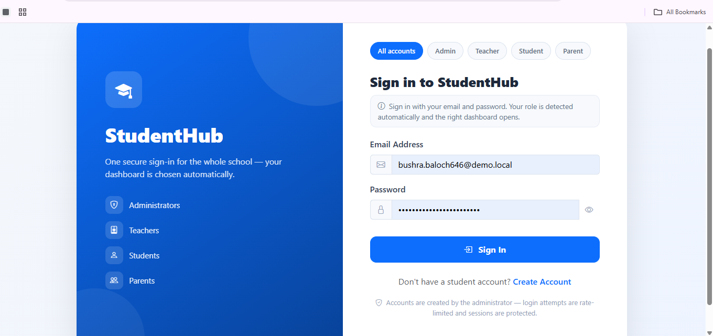

### Admin Dashboard

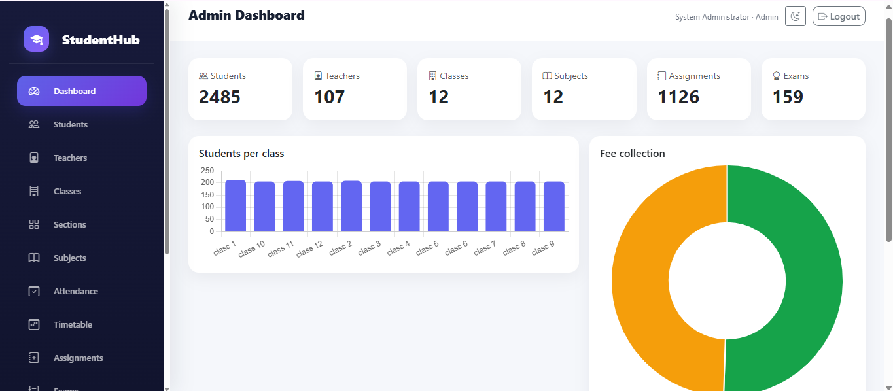

### Student Management

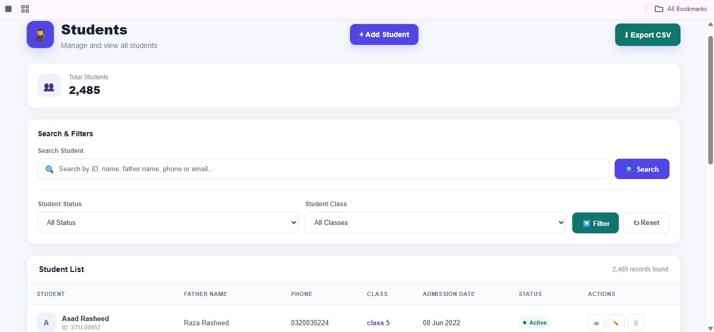

### Teacher Management

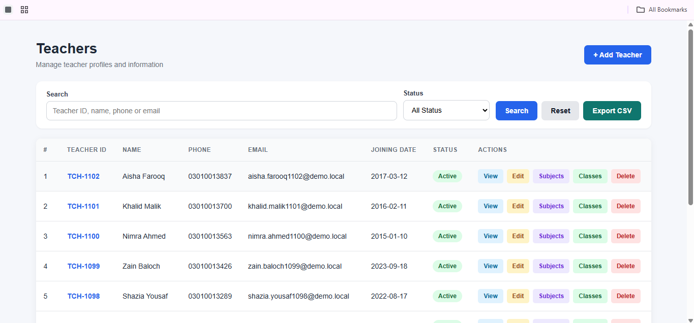

### Class Management

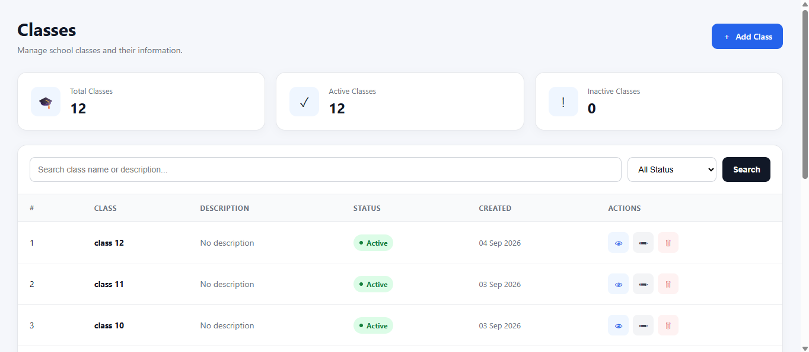

### Section Management

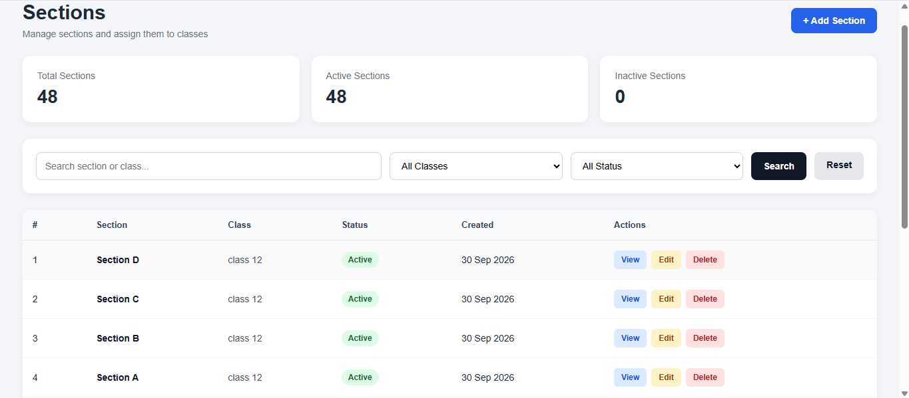

### Teacher Dashboard

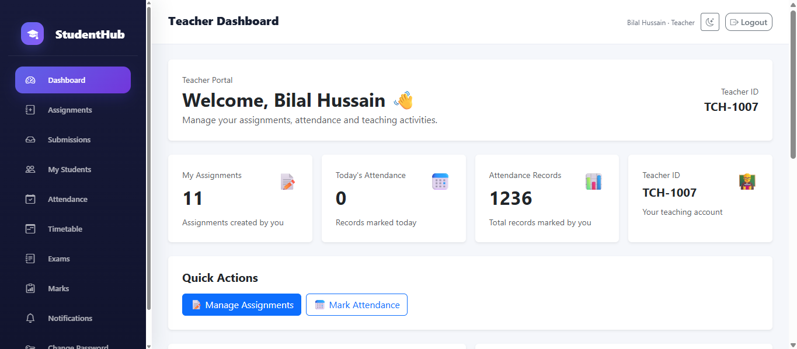

### Attendance

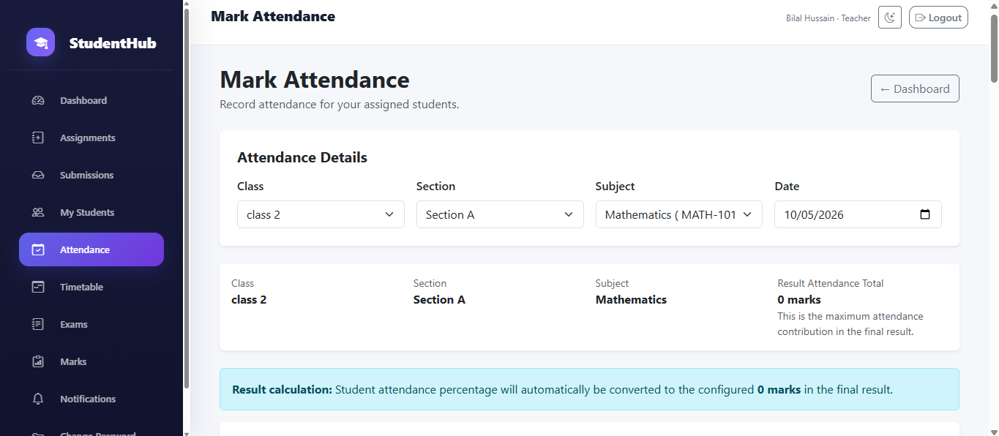

### Exams

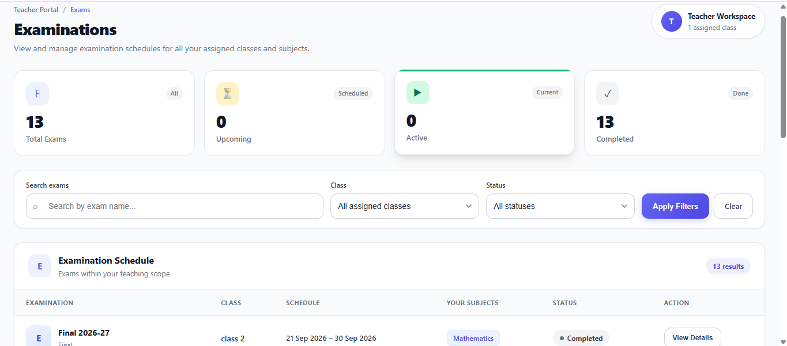

### Marks Management

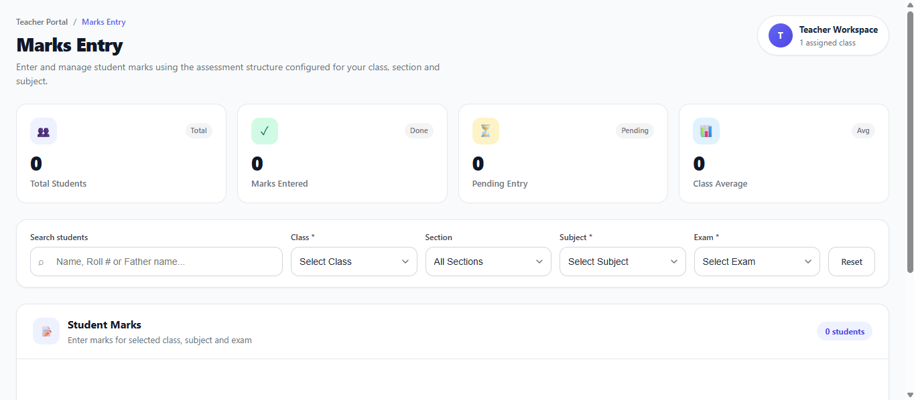

### Student Results

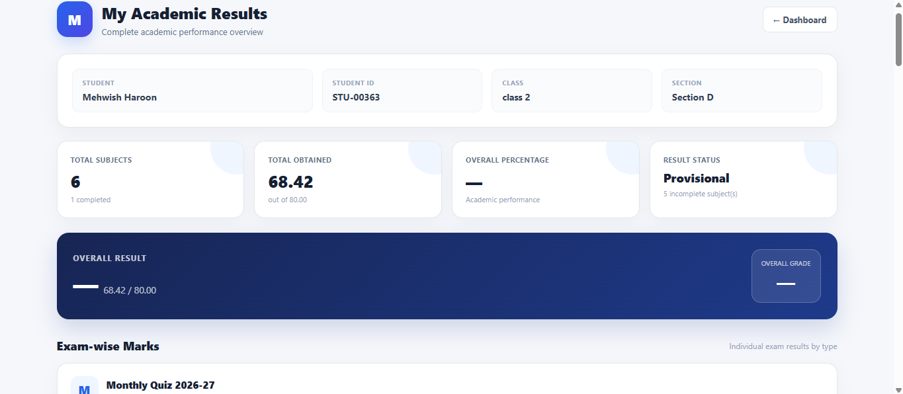

### Result Details

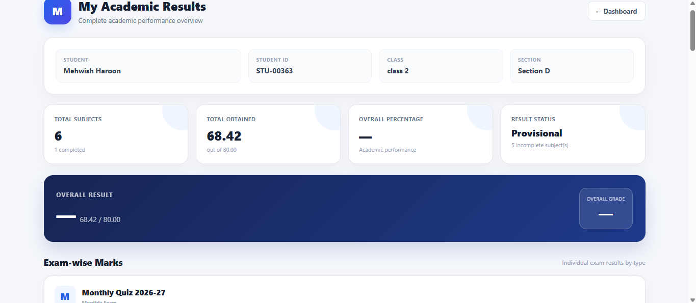

### Assignments

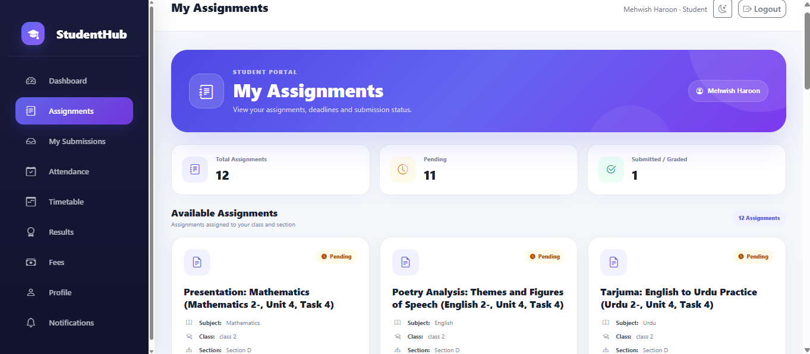

### Fees

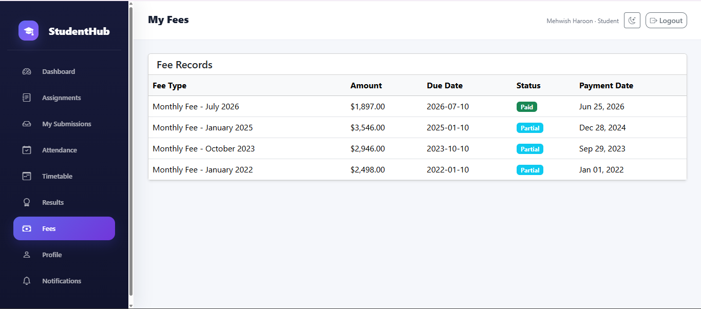

### Timetable

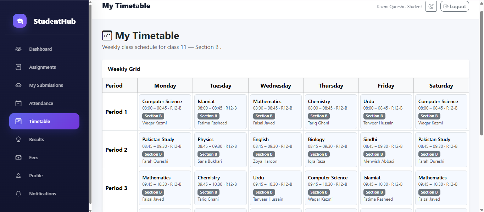

### Parent Dashboard

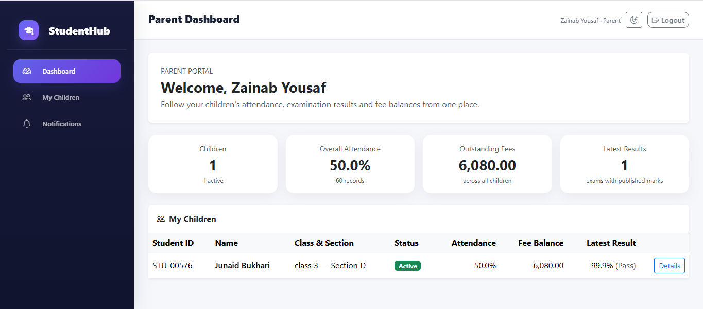

### Parent Child Details

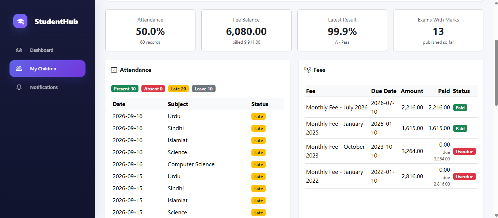

## Project Objective

The primary goal of StudentHub was to build a substantial backend-oriented application using **Pure PHP and Object-Oriented Programming**, rather than relying on a PHP framework.

The project focuses on understanding how a real-world web application works internally, including:

- Authentication
- Authorization
- Database relationships
- CRUD operations
- Business logic
- Validation
- Security
- Session management
- Role-based workflows
- File handling
- Reporting
- Academic management workflows

This project also serves as a foundation for transitioning to modern PHP frameworks and applying the backend concepts learned through Pure PHP in framework-based environments.

## Project Status

**Active portfolio project**

The system is continuously tested, improved, and refined with a focus on production-quality backend practices.

## Developer

**Ali Anwar**

Junior Backend Web Developer

### Core Skills

- PHP
- Object-Oriented PHP
- MySQL
- HTML5
- CSS3
- JavaScript
- Bootstrap 5.3
- Git
- GitHub

---

If you find this project useful, feel free to explore the GitHub repository.